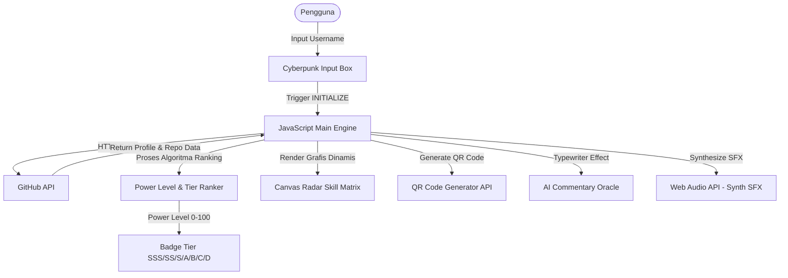
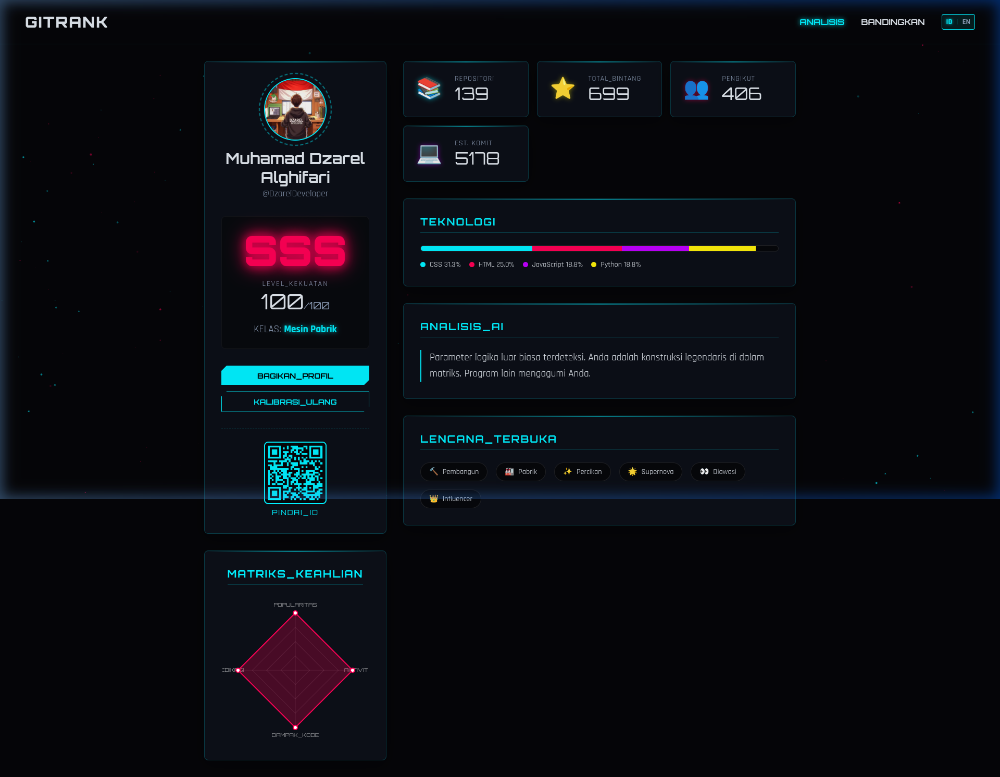

# GitRank

> **Part of [CodeSphred Community](https://github.com/Codesphered01010)**  
> *Project ini adalah salah satu hasil karya member komunitas dalam repositori [Community Case Studies](https://github.com/Codesphered01010/community-case-studies).*

---

> **GitRank** adalah platform penganalisis profil GitHub (GitHub Profile Analyzer) interaktif dengan visual bertema cyberpunk retro-futuristik. Aplikasi ini mendekripsi statistik GitHub Anda (seperti repositori publik, jumlah bintang/stargazers, pengikut, dan estimasi total komit) secara real-time untuk menentukan peringkat level kekuatan (*Power Level*) global dari Tier D hingga SSS, serta mendefinisikan kelas spesifik Anda (*Code Wizard*, *Social Hacker*, *Factory Machine*, atau *Rising Rookie*). Proyek ini juga dilengkapi dengan **1v1 Battle Arena** interaktif berkemampuan efek benturan laser dan suara cyberpunk yang seru untuk membandingkan statistik coding Anda dengan rekan developer lainnya.

## Author
*Sebutkan siapa saja yang berkontribusi dalam project ini.*
- **DzarelDeveloper** - Fullstack Developer - [GitHub](https://github.com/DzarelDeveloper)

## Tech Stack
*Sebutkan teknologi, framework, atau library utama yang digunakan.*
- **HTML5:** Struktur semantik untuk aplikasi satu halaman.
- **Vanilla CSS:** Tema neon cyberpunk futuristik, efek glassmorphic modern, animasi transisi halus, dan grid responsif.
- **Vanilla JavaScript:** Pengelola logika utama (*Core Engine*) dan pengelolaan *state* aplikasi.
- **GitHub REST API:** Sumber data asinkron langsung dari grid GitHub.
- **HTML5 Canvas API:** Menggambar latar belakang partikel mengambang (*Dynamic Particle Canvas*) dan visualisasi grafik radar keahlian (*Radar Skill Matrix*) secara native.
- **Web Audio API:** Sintesis efek suara cyberpunk retro (*programmatic synth SFX*) untuk efek melayang, pengetikan teks, dan pemrosesan reveal ranking tanpa unduhan aset audio statis.
- **QR Code API:** Pembuat kode QR dinamis untuk berbagi identitas developer secara langsung.

## Architecture / System Design
*Jelaskan alur kerja aplikasi atau arsitektur sistemnya. Kamu bisa menambahkan diagram (flowchart/C4 model) jika ada.*

Aplikasi ini menggunakan arsitektur **Client-Side Single Page Application (SPA)** murni tanpa server perantara, menghasilkan pemuatan halaman yang sangat cepat (seluruh ukuran berkas gabungan < 80KB) dan nol dependensi eksternal.

### Alur Kerja & Detil Sistem:
1. **Perekaman Asinkron:** JavaScript mengirimkan *fetch requests* paralel langsung ke endpoint GitHub REST API (`/users/{username}` & `/users/{username}/repos`) untuk memproses statistik.
2. **Kalkulasi Power Level:** Level kekuatan dihitung secara dinamis dari kombinasi:
   - Jumlah followers (bobot maksimal 30 poin)
   - Akumulasi total bintang repositori (bobot maksimal 40 poin)
   - Jumlah total repositori publik (bobot maksimal 30 poin)
   - Bonus multiplier untuk akun dengan reputasi tinggi (>500 bintang / >1000 followers).
3. **Canvas Radar Matrix:** Matriks keahlian (Popularitas, Aktivitas, Dampak Kode, Dedikasi) digambar dengan presisi trigonometri polar di atas elemen Canvas HTML5 murni.
4. **1v1 Battle Engine:** Membandingkan level daya tempur dua username pilihan, mensimulasikan pemuatan arena dengan laser beam bentrok (merah muda vs biru muda), dan menobatkan pemenang mutlak dengan tanda mahkota emas.

## Sistem Klasifikasi Rank & Kelas (Tiers & Archetypes)

Aplikasi ini menggunakan algoritma khusus untuk mengevaluasi data profil GitHub dan memetakannya ke dalam tingkatan peringkat (*Tiers*) serta kategori tipe keahlian pengkodean (*Archetypes*).

### 🏆 Tabel Tingkatan Tier (Dari Tertinggi SSS ke Terendah D)

| Pangkat (Tier) | Rentang Skor (Min. Score) | Warna Representatif | Arti & Karakteristik |
| :---: | :---: | :---: | :--- |
| **`SSS`** | `95 - 100` | `#ff0055` (Neon Pink) | **Legendary God-Tier:** Konstruksi legendaris di matriks pengkodean, performa luar biasa di semua lini. |
| **`SS`** | `85 - 94` | `#fcee0a` (Neon Yellow) | **Ultra Elite:** Memiliki integritas dan dedikasi luar biasa aktif di GitHub. |
| **`S`** | `75 - 84` | `#00f0ff` (Neon Cyan) | **Elite Cyber:** Profil teroptimasi, bercahaya cukup terang untuk menerangi grid digital. |
| **`A`** | `60 - 74` | `#00ff66` (Neon Green) | **High Grade:** Berhasil menembus tingkat atas pertahanan dan berkontribusi secara solid. |
| **`B`** | `45 - 59` | `#bf00ff` (Neon Purple) | **Mid Grade:** Kapasitas operasional standar yang memadai dan berpotensi tinggi. |
| **`C`** | `25 - 44` | `#ff9900` (Neon Orange) | **Initiate Protokol:** Pengembang yang baru memulai perjalanan melintasi sprawls digital. |
| **`D`** | `0 - 24` | `#8b9bb4` (Cyber Gray) | **Ghost / Rookie / Terendah:** Pengembang yang jarang terhubung atau hampir tidak memiliki aktivitas aktif. |

### 🛠️ Tabel Kelas Developer (Archetypes)

Kategori kelas ini mendefinisikan kepribadian atau gaya kerja developer di GitHub berdasarkan perbandingan parameter statistik:

| Kelas / Archetype | Nama (Bahasa Indonesia) | Nama (English) | Syarat Kondisi Algoritma | Penjelasan Karakteristik |
| :--- | :--- | :--- | :--- | :--- |
| **`CODE_WIZARD`** | Penyihir Kode | *Code Wizard* | `stars > (followers * 2)` DAN `stars > 50` | Memiliki reputasi tinggi dari bintang (*stargazers*) dibanding pengikut. Kode Anda sangat disukai! |
| **`SOCIAL_HACKER`** | Peretas Sosial | *Social Hacker* | `followers > (stars * 2)` DAN `followers > 50` | Memiliki jangkauan sosial dan pengikut yang melimpah dibanding bintang. Anda adalah influencer digital! |
| **`FACTORY_MACHINE`** | Mesin Pabrik | *Factory Machine* | `repos > 50` (Kondisi di atas tidak terpenuhi) | Super produktif menghasilkan proyek nyata, memiliki lebih dari 50 repositori publik! |
| **`RISING_ROOKIE`** | Pemula Berbakat | *Rising Rookie* | *Default / Else* (Kondisi di atas tidak terpenuhi) | Profil yang sedang berkembang dengan potensi besar untuk naik ke kelas yang lebih tinggi. |

## Features
*Sebutkan fitur-fitur unggulan dari project ini.*
- [x] **Futuristic Cyberpunk UI/UX:** Desain retro-futuristik memukau dengan partikel latar belakang mengalir bebas, *glitch effects* interaktif, card *glassmorphic*, dan efek kemiringan 3D dinamis (*Tilt Effect*) pada panel saat disentuh kursor.
- [x] **Bilingual Support (ID/EN):** Fitur lokalisasi multibahasa lengkap (Bahasa Indonesia & Bahasa Inggris) yang dapat berganti secara instan tanpa memicu pemuatan ulang halaman (*no-reload*).
- [x] **Power Level & 7-Tier Ranking:** Evaluasi performa coding real-time dari profil developer dengan pangkat terbagi dari Tier D hingga Tier SSS yang legendaris.
- [x] **4 Developer Archetype Classes:** Mengelompokkan gaya kerja developer ke dalam 4 spesifikasi unik: *Code Wizard* (Kaya Bintang), *Social Hacker* (Populer), *Factory Machine* (Super Produktif), dan *Rising Rookie* (Pemula Berbakat).
- [x] **Dynamic Canvas Radar Chart:** Bagan radar interaktif native buatan sendiri di Canvas HTML5 untuk visualisasi pemetaan kompetensi pengkodean tanpa library visual pihak ketiga.
- [x] **1v1 Battle Arena (Fight Mode):** Fitur pertarungan adu statistik antardua pengguna dengan visualisasi perang laser kinetik biru vs pink yang intens.
- [x] **Interactive Synth Audio (Web Audio API):** Efek suara retro-futuristik yang dikompilasi secara real-time lewat node osilator audio di browser, menghemat memori dan penyimpanan.
- [x] **AI Oracle Commentary:** Ulasan evaluasi profil developer dari "AI Oracle" yang dicetak dengan efek mesin tik dramatis (*Typewriter Effect*).
- [x] **Interactive Badges:** 7 tipe lencana pencapaian (Builder, Factory, Spark, Supernova, Watched, Influencer, Newbie) yang terbuka otomatis sesuai kriteria performa akun.
- [x] **Profile Scanner QR Generator:** Menyematkan QR Code dinamis berisi tautan ke akun profil GitHub asli pengguna yang siap dipindai oleh sesama developer.

## Challenges & Learnings
*Ceritakan tantangan terbesar saat membuat project ini dan apa yang kamu pelajari.*
- **Tantangan:**
  - Menggambar visual radar chart yang presisi, responsif, dan stabil, serta efek animasi sinar laser 1v1 murni menggunakan API Canvas 2D tanpa memuat perpustakaan grafis eksternal yang berat demi performa optimal.
  - Menghasilkan pengalaman multisensori audio retro-futuristik yang imersif tanpa mengandalkan berkas audio statis (.mp3/.wav) tambahan.
- **Solusi & Pelajaran:**
  - Mempelajari kalkulasi matematika sudut polar (mengonversi radian ke posisi koordinat Cartesian X & Y pada Canvas) untuk melukis diagram segi empat radar secara dinamis berdasarkan parameter statistik akun.
  - Memahami dasar-dasar **Web Audio API** dengan menghubungkan `OscillatorNode` (untuk sintesis gelombang suara sine, square, dan sawtooth) ke `GainNode` secara programmatic untuk memproduksi efek suara interaktif yang berukuran 0-byte pada berkas fisik.

## Impact / Results
*Apa hasil nyata setelah project ini selesai/dideploy? (Opsional)*
- **Performa Maksimal:** Menghasilkan aplikasi web tanpa dependensi luar (*Zero Dependencies*) yang memuat dalam sekejap mata dengan skor Google Lighthouse 100%.
- **Optimalisasi File:** Seluruh ukuran file kode gabungan sangat minimalis (< 80KB), membuktikan bahwa visual premium dan animasi kaya tidak harus mengorbankan kecepatan akses.
- **Interaksi Komunitas:** Memberikan wadah interaktif yang menyenangkan bagi komunitas developer dalam membandingkan, bersaing secara sehat, dan merayakan pencapaian perjalanan pengkodean mereka di GitHub.

## Screenshot
*Tambahkan screenshot atau GIF dari projectmu agar member lain bisa melihat hasilnya!*

## Demo / Repository Link
- **Live Demo:** [https://dzareldeveloper.github.io/GitRank/](https://github.com/DzarelDeveloper/GitRank)
- **Original Repo:** [https://github.com/DzarelDeveloper/GitRank](https://github.com/DzarelDeveloper/GitRank)

## License
*Project ini berada di bawah lisensi [MIT/Apache/dll].*
Proyek ini dilisensikan di bawah **MIT License**.

