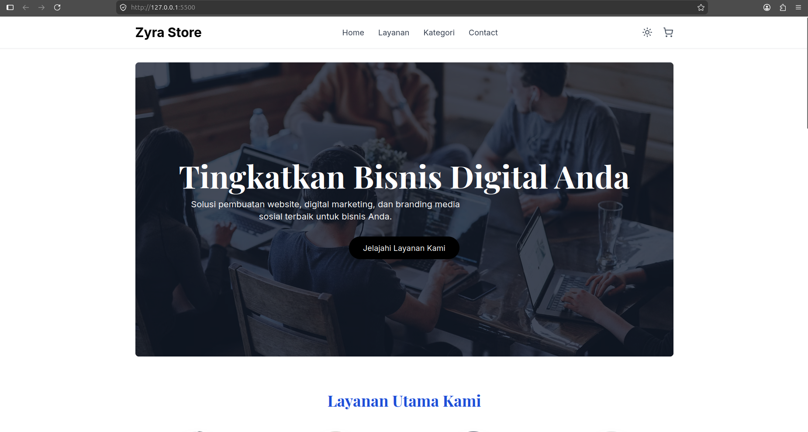
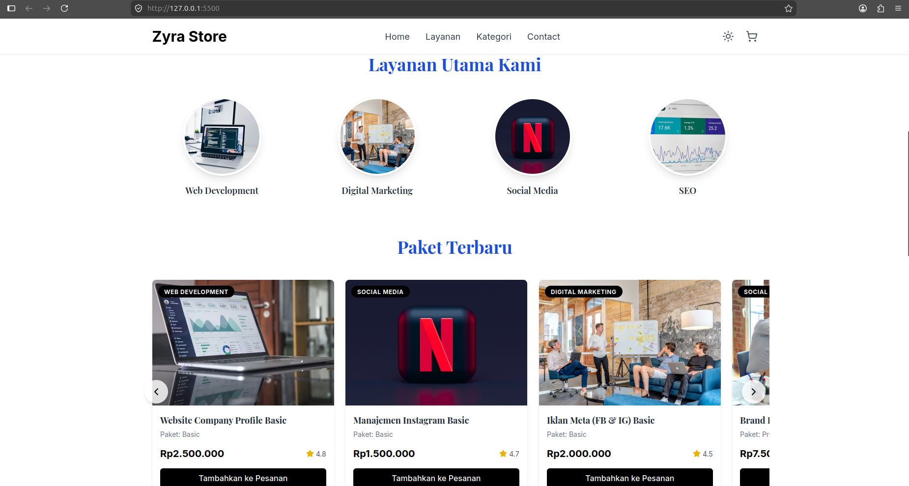
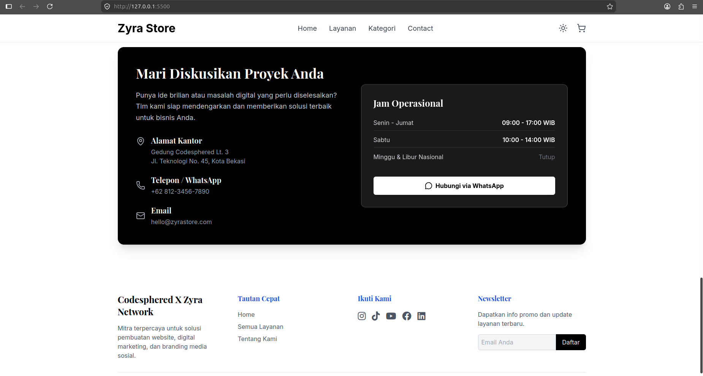

# Zyra Store - Digital Agency & E-Commerce Platform

> **Part of [CodeSphred Community](https://github.com/Codesphered01010)**  
> *Project ini adalah salah satu hasil karya member komunitas dalam repositori [Community Case Studies](https://github.com/Codesphered01010/community-case-studies).*

---

> *Zyra Store adalah platform digital agency berbasis Single Page Application yang menyediakan layanan pembuatan website, pemasaran digital, optimasi SEO, dan manajemen media sosial, memudahkan klien mengelola proyek secara online tanpa backend berat, menyelesaikan masalah integrasi layanan dan pengalaman pengguna yang tidak konsisten.*

## Author
*Sebutan siapa saja yang berkontribusi dalam project ini.*
- **Muhamad Dzarel Alghifari** - Fullstack Developer - [GitHub](https://github.com/DzarelDeveloper)

## Tech Stack
*Proyek ini dibangun tanpa framework frontend berat, murni menggunakan teknologi fundamental yang dikemas modern:*
- **HTML5 & Vanilla JavaScript**: Struktur semantik modern dan logika client‑side murni.
- **Tailwind CSS (via CDN)**: Utility‑first CSS framework untuk mempercepat pengembangan desain responsif.
- **Lucide Icons & FontAwesome (via CDN)**: Koleksi ikon UI minimalis serta logo media sosial.
- **Google Fonts**: Menggunakan font Playfair Display dan Inter.

## Architecture / System Design
*Jelaskan alur kerja aplikasi atau arsitektur sistemnya. Kamu bisa menambahkan diagram (flowchart/C4 model) jika ada.*
- **Frontend:** Mengambil data melalui REST API.
- **Backend:** Menangani autentikasi dengan JWT dan menyimpan data ke database.

## Features
*Fitur utama yang diimplementasikan di Zyra Store:*
- **SPA Experience** – navigasi mulus tanpa reload halaman.
- **Dark Mode** – toggle tema gelap/terang instant.
- **Dynamic Service Catalog** – filtrasi & sorting paket layanan.
- **Cart & Checkout** – penambahan layanan ke daftar pesanan dengan estimasi biaya.
- **Form Validation** – cek email & nomor WA Indonesia.
- **Smooth Scrolling & Navigation** – pengalaman navigasi profesional.

## Challenges & Learnings
*Ceritakan tantangan terbesar saat membuat project ini dan apa yang kamu pelajari.*
- **Tantangan:** Kesulitan saat mengelola state management yang kompleks.
- **Solusi/Pelajaran:** Mempelajari Redux Toolkit membuat pengelolaan state jauh lebih mudah dan rapi.

## Impact / Results
*Hasil yang dapat diadopsi sebagai katalog bisnis universal, dapat digunakan untuk banyak jenis usaha.*
- Platform menyediakan katalog digital yang dapat disesuaikan untuk berbagai bisnis, mempercepat peluncuran layanan tanpa kebutuhan backend khusus.
- Memungkinkan integrasi cepat layanan baru, meningkatkan keterlibatan pelanggan, dan memperluas jangkauan pasar.

## Screenshot
*Tambahkan screenshot atau GIF dari projectmu agar member lain bisa melihat hasilnya!*

## Demo / Repository Link
- **Live Demo:** [Demo Link](https://dzareldeveloper.github.io/Website-Ecommerce/)
- **Original Repo:** [Website-Ecommerce Repo](https://github.com/DzarelDeveloper/Website-Ecommerce)
- **Figma:** - (Tidak tersedia)

## License
*Project ini berada di bawah lisensi [MIT/Apache/dll].*
